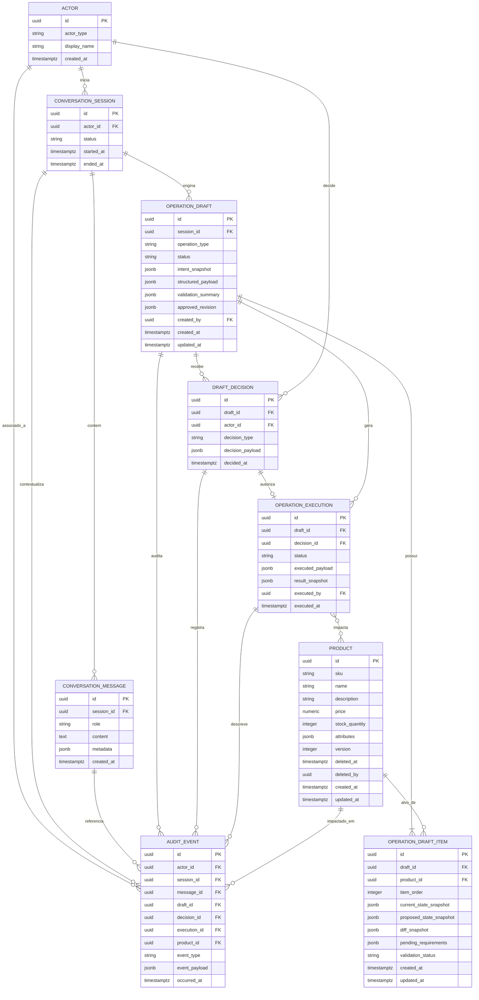

# ADR-005 — Relacionamento de Entidades da POC do Copiloto Conversacional de Estoque

## Objetivo

Este ADR documenta o modelo de relacionamento de entidades da POC do copiloto conversacional de estoque, consolidando:

- as decisões já registradas sobre arquitetura, banco de dados, padrões de projeto e estrutura de versionamento;
- a meta da iniciativa;
- a descrição do EPIC;
- as exigências de rastreabilidade, confirmação explícita, draft interativo, streaming e soft delete.

O objetivo deste documento é justificar **quais entidades precisam existir**, **como elas se relacionam** e **por que esse relacionamento é coerente com o fluxo funcional da POC**.

---

## Contexto

A POC não é apenas um chat com persistência simples de mensagens.

O produto precisa:

- entender solicitações em linguagem natural;
- responder em linguagem natural;
- entregar respostas em streaming, com renderização progressiva na interface;
- transformar toda intenção operacional em uma proposta estruturada;
- apresentar essa proposta em uma tabela interativa;
- permitir revisão, edição, negação ou confirmação na mesma interação;
- bloquear qualquer execução implícita;
- exigir confirmação explícita antes de create, read, update ou delete;
- preservar histórico e rastreabilidade ponta a ponta;
- executar deleção exclusivamente por soft delete.

Isso significa que o modelo de dados não pode ser centrado apenas em `product`.

O sistema precisa persistir não só o estado de negócio, mas também o **encadeamento operacional da conversa**, desde a intenção do usuário até a execução final auditável.

Em termos práticos, a POC precisa sustentar o seguinte fluxo:

> **ator solicita → sessão contextualiza → mensagens registram a conversa → draft estrutura a proposta → decisão explicita aprovação ou rejeição → execução aplica o que foi aprovado → auditoria preserva a trilha completa**

---

## Decisão principal

O modelo de relacionamento de entidades da POC deve ser estruturado em torno de **nove entidades centrais**:

1. `actor`
2. `conversation_session`
3. `conversation_message`
4. `operation_draft`
5. `operation_draft_item`
6. `draft_decision`
7. `operation_execution`
8. `audit_event`
9. `product`

Esse conjunto foi escolhido porque ele representa, de forma explícita e auditável, o fluxo exigido pelo EPIC:

- intenção em linguagem natural;
- proposta estruturada;
- revisão controlada;
- confirmação explícita;
- execução segura;
- histórico preservado.

---

## Princípio de modelagem

A modelagem foi orientada pelo mesmo princípio já adotado nos ADRs anteriores:

> **IA interpreta e propõe; domínio valida; usuário confirma; sistema executa.**

Esse princípio tem efeito direto no relacionamento entre entidades.

A POC não pode permitir que uma mensagem de linguagem natural vire operação persistida diretamente sobre `product`.

Por isso, o modelo foi desenhado para explicitar as camadas intermediárias obrigatórias:

- a conversa gera contexto;
- o contexto gera draft;
- o draft gera decisão;
- a decisão autorizada gera execução;
- a execução gera auditoria;
- a deleção em `product` preserva histórico por soft delete.

---

## Entidades centrais e suas justificativas

### 1. `actor`

Representa o ator que interage com o sistema.

Pode corresponder, por exemplo, ao usuário operador da interface ou a outro agente autorizado no futuro.

#### Por que existe

A POC exige rastreabilidade ponta a ponta. Logo, o sistema precisa saber **quem originou a solicitação**, **quem confirmou a operação** e **quem ficou vinculado aos eventos relevantes**.

Sem `actor`, a trilha de auditoria perderia autoria explícita.

#### Responsabilidades principais

- identificar o solicitante;
- vincular autoria de sessão, mensagem, decisão e auditoria;
- sustentar responsabilização operacional.

---

### 2. `conversation_session`

Representa a sessão conversacional em que uma solicitação é construída, refinada e decidida.

#### Por que existe

A POC precisa manter continuidade da mesma interação até a decisão final do usuário. Isso exige uma entidade que concentre o contexto operacional da conversa.

Sem `conversation_session`, seria difícil garantir:

- manutenção do mesmo draft ao longo da solicitação;
- agrupamento de mensagens da mesma operação;
- vínculo entre conversa, draft, decisão e execução.

#### Responsabilidades principais

- agrupar mensagens relacionadas;
- delimitar o contexto da solicitação;
- permitir múltiplos drafts ao longo da sessão, quando necessário;
- servir como eixo de consulta auditável.

---

### 3. `conversation_message`

Representa cada mensagem trocada durante a interação.

Pode registrar mensagens do usuário, do copiloto e mensagens técnicas relevantes ao fluxo conversacional.

#### Por que existe

A POC precisa ser conversacional na interface e rastreável na operação. Isso exige persistência das mensagens que participam da interpretação e da formação da proposta.

`conversation_message` não existe apenas para histórico visual. Ela sustenta:

- reconstrução da intenção original;
- contexto de refinamento incremental;
- transparência sobre o que foi pedido e respondido;
- auditoria contextual da operação.

#### Responsabilidades principais

- armazenar conteúdo textual da conversa;
- registrar papel da mensagem (`user`, `assistant`, `system`, por exemplo);
- vincular mensagem à sessão;
- opcionalmente referenciar draft ou execução correlata.

---

### 4. `operation_draft`

Representa a proposta estruturada de operação gerada a partir da intenção do usuário.

É a entidade central do fluxo operacional da POC.

#### Por que existe

O EPIC exige que nenhuma operação seja executada de forma implícita. Toda solicitação deve virar uma proposta estruturada antes de qualquer execução.

Essa exigência torna `operation_draft` indispensável.

Ele existe para materializar o intervalo obrigatório entre:

- intenção do usuário;
- validação da operação;
- confirmação explícita;
- execução final.

#### Responsabilidades principais

- representar o tipo de operação (`create`, `read`, `update`, `delete`);
- armazenar o estado do draft no ciclo de vida operacional;
- guardar proposta estruturada, filtros, parâmetros e snapshots relevantes;
- preservar a versão aprovada que servirá de base para a execução.

#### Campos conceituais esperados

- `id`
- `session_id`
- `operation_type`
- `status`
- `intent_snapshot`
- `structured_payload`
- `validation_summary`
- `approved_revision`
- `created_by`
- `created_at`
- `updated_at`

---

### 5. `operation_draft_item`

Representa cada item individual dentro de um draft.

É especialmente importante quando a proposta envolve múltiplos produtos, múltiplos alvos de atualização ou múltiplos resultados estruturados para leitura.

#### Por que existe

O EPIC exige que a tabela interativa permita revisão por item, inclusive com pendências na criação e comparação clara na atualização.

Se o modelo tivesse apenas `operation_draft`, sem granularidade de itens, seria difícil sustentar:

- validação item a item;
- pendências por item;
- comparação entre estado atual e proposto por item;
- leitura estruturada com múltiplos registros;
- consistência fina entre draft aprovado e execução.

#### Responsabilidades principais

- representar a unidade operacional dentro do draft;
- guardar estado atual, estado proposto e diff quando aplicável;
- registrar pendências específicas;
- referenciar o produto-alvo quando existir.

#### Campos conceituais esperados

- `id`
- `draft_id`
- `product_id` (nullable em algumas leituras ou criações ainda não persistidas)
- `item_order`
- `current_state_snapshot`
- `proposed_state_snapshot`
- `diff_snapshot`
- `pending_requirements`
- `validation_status`
- `created_at`
- `updated_at`

---

### 6. `draft_decision`

Representa a decisão explícita do usuário sobre um draft.

Pode assumir semânticas como confirmação, rejeição, cancelamento ou revisão final registrada.

#### Por que existe

A POC exige confirmação explícita obrigatória antes de qualquer execução. Essa confirmação não pode ficar implícita em memória nem dispersa em texto livre.

Ela precisa existir como registro formal persistido.

`draft_decision` existe exatamente para tornar audível e verificável o momento em que o usuário:

- confirmou;
- negou;
- cancelou;
- revisou formalmente a proposta.

#### Responsabilidades principais

- registrar a decisão explícita do usuário;
- vincular a decisão ao draft correspondente;
- armazenar autoria e momento da decisão;
- servir de pré-condição formal para a execução.

#### Campos conceituais esperados

- `id`
- `draft_id`
- `actor_id`
- `decision_type`
- `decision_payload`
- `decided_at`

---

### 7. `operation_execution`

Representa a execução efetiva de uma operação já autorizada.

#### Por que existe

A POC precisa garantir que o que foi executado corresponda ao draft aprovado.

Isso exige uma entidade própria para execução, separada do draft.

Sem `operation_execution`, o sistema teria dificuldade para distinguir:

- o que foi apenas proposto;
- o que foi aprovado;
- o que foi realmente executado;
- qual foi o resultado operacional da execução.

#### Responsabilidades principais

- registrar a operação efetivamente aplicada;
- vincular execução ao draft aprovado;
- guardar status, resultado, timestamps e metadados de execução;
- permitir comparação entre proposta e aplicação real.

#### Campos conceituais esperados

- `id`
- `draft_id`
- `decision_id`
- `status`
- `executed_payload`
- `result_snapshot`
- `executed_at`
- `executed_by`

---

### 8. `audit_event`

Representa a trilha de auditoria do sistema.

#### Por que existe

Rastreabilidade é requisito explícito do EPIC e dos RNFs. A aplicação precisa conseguir responder, com precisão:

- quem pediu;
- o que foi entendido;
- o que foi proposto;
- o que foi confirmado;
- o que foi executado;
- quando isso aconteceu;
- em qual contexto conversacional.

`audit_event` existe para preservar essa trilha de forma imutável e consultável.

#### Responsabilidades principais

- registrar eventos relevantes do ciclo de vida;
- vincular evento a sessão, draft, decisão, execução e produto, quando aplicável;
- preservar trilha cronológica e semântica do fluxo.

#### Campos conceituais esperados

- `id`
- `session_id`
- `message_id` (nullable)
- `draft_id` (nullable)
- `decision_id` (nullable)
- `execution_id` (nullable)
- `product_id` (nullable)
- `actor_id` (nullable)
- `event_type`
- `event_payload`
- `occurred_at`

---

### 9. `product`

Representa a entidade de negócio do domínio de estoque contemplada nesta POC.

#### Por que existe

Embora a POC trate fortemente de conversa, draft, confirmação e auditoria, o alvo operacional concreto continua sendo `product`.

É nele que incidem:

- criação;
- leitura;
- atualização;
- deleção lógica.

#### Responsabilidades principais

- representar o agregado principal de negócio do escopo atual;
- preservar os atributos operados pela POC;
- suportar controle de versão e soft delete;
- servir como alvo de drafts, execuções e auditoria.

#### Campos conceituais esperados

- `id`
- `sku` (quando aplicável)
- `name`
- `description`
- `price`
- `stock_quantity` ou equivalentes do recorte adotado
- `attributes` (opcional, como complemento para metadados variáveis)
- `version`
- `deleted_at`
- `deleted_by`
- `created_at`
- `updated_at`

---

## Relações principais e justificativas

### `actor` 1:N `conversation_session`

Um ator pode iniciar múltiplas sessões ao longo do tempo.

Essa relação existe para preservar autoria e separar contextos conversacionais distintos.

### `conversation_session` 1:N `conversation_message`

Uma sessão contém várias mensagens.

Essa relação é indispensável para reconstruir a conversa e sustentar o contexto da solicitação.

### `conversation_session` 1:N `operation_draft`

Uma sessão pode originar múltiplos drafts ao longo de refinamentos ou solicitações diferentes dentro do mesmo contexto.

Essa relação permite preservar histórico sem perder continuidade.

### `operation_draft` 1:N `operation_draft_item`

Um draft pode conter um ou vários itens.

Essa granularidade é necessária para criação, leitura, atualização e deleção com revisão por item.

### `operation_draft` 1:N `draft_decision`

Um draft pode receber mais de um registro de decisão ao longo do seu ciclo de vida, embora regras específicas possam restringir mais de uma decisão final válida.

Esse relacionamento preserva a trilha de revisão e decisão explícita.

### `draft_decision` 1:1 ou 1:N controlado `operation_execution`

No fluxo principal da POC, a execução final esperada é uma por decisão confirmatória válida. Conceitualmente, o relacionamento é próximo de 1:1, mas pode ser modelado fisicamente com controles para reprocessamento técnico, desde que não haja múltiplas execuções finais indevidas para o mesmo draft aprovado.

### `operation_draft` 1:0..N `operation_execution`

Do ponto de vista histórico, um draft pode nunca ser executado, ou pode gerar uma execução quando confirmado. A relação existe para diferenciar proposta de aplicação efetiva.

### `operation_draft_item` N:1 `product`

Itens do draft podem apontar para um produto existente quando a operação é leitura, atualização ou deleção. Em criação, essa referência pode ser nula até a persistência do produto.

### `operation_execution` relação conceitual com `product`

Uma execução pode impactar um ou mais produtos, dependendo da granularidade física adotada. Neste ADR, a relação é mostrada de forma conceitual para evidenciar o produto afetado no fluxo auditável. Em implementação, esse vínculo pode aparecer de forma indireta via `operation_draft_item`, via `audit_event` ou via associação complementar quando uma mesma execução agregar múltiplos produtos.

### `audit_event` N:1 com praticamente todas as entidades centrais

`audit_event` funciona como trilha transversal e pode referenciar sessão, mensagem, draft, decisão, execução, produto e ator, conforme o tipo do evento.

Essa maleabilidade é necessária porque nem todo evento pertence ao mesmo ponto do fluxo.

---

## Diagrama de relacionamento de entidades

### Versão em Mermaid



### Versão textual simplificada

```txt
actor
  └──< conversation_session
          ├──< conversation_message
          ├──< operation_draft
          │       ├──< operation_draft_item >── product
          │       ├──< draft_decision >── actor
          │       │       └── o operation_execution
          │       └──< operation_execution >── product
          │
          └──< audit_event
                   ├──> conversation_message (opcional)
                   ├──> operation_draft (opcional)
                   ├──> draft_decision (opcional)
                   ├──> operation_execution (opcional)
                   ├──> product (opcional)
                   └──> actor (opcional)
```

---

## Justificativa do desenho relacional

## 1. O fluxo da POC exige mais do que uma entidade de produto

Se a modelagem fosse reduzida a `product` + `messages`, o sistema não conseguiria representar corretamente a exigência central do EPIC: nenhuma operação pode ser executada de forma implícita.

A existência de `operation_draft`, `draft_decision` e `operation_execution` é o que separa, no banco e no domínio:

- intenção;
- proposta;
- aprovação;
- execução.

Essa separação é essencial para previsibilidade e segurança operacional.

## 2. A rastreabilidade precisa ser nativa do modelo

Rastreabilidade não pode ser tratada como log periférico.

Ela precisa nascer no desenho das entidades.

Por isso, `conversation_session`, `conversation_message`, `draft_decision`, `operation_execution` e `audit_event` formam um encadeamento que permite responder não só “o que existe hoje”, mas “como o sistema chegou até esse resultado”.

## 3. A tabela interativa exige granularidade por item

O EPIC exige pendência por item em criação, comparação clara em atualização e possibilidade de revisão sem gerar nova tabela.

Isso justifica fortemente a entidade `operation_draft_item`.

Sem ela, a tabela interativa ficaria achatada em uma estrutura genérica demais, pouco adequada para validação fina.

## 4. Soft delete impacta diretamente o relacionamento

O fluxo de deleção da POC não remove fisicamente `product`.

Logo, a modelagem precisa prever preservação histórica no próprio produto, com campos como:

- `deleted_at`;
- `deleted_by`;
- `version`.

Essa decisão também protege a integridade das referências históricas vindas de draft, execução e auditoria.

## 5. O modelo precisa favorecer PostgreSQL e integridade transacional

Como a POC já decidiu por PostgreSQL, o modelo foi pensado para se beneficiar de:

- foreign keys explícitas;
- constraints por status;
- índices por timestamps e chaves de navegação;
- controle de concorrência em `product`;
- separação entre estrutura relacional e payloads variáveis em `JSONB`.

Isso reforça a escolha relacional e evita transformar o fluxo em um grande documento opaco.

---

## Alinhamento com a arquitetura hexagonal/modular

O relacionamento entre entidades confirma a decisão arquitetural anterior.

A modelagem mostra que a POC não deve depender de controllers “inteligentes” nem de acesso direto da interface ao banco.

O encadeamento entre sessão, draft, decisão, execução e auditoria exige um backend onde:

- a **controller** adapte transporte;
- a **service** coordene caso de uso e regra de negócio;
- os **repositories/adapters** encapsulem persistência e integrações;
- o **domínio** preserve invariantes do fluxo.

Em outras palavras, o próprio modelo de entidades reforça a necessidade de separação clara entre conversa, validação e execução.

---

## Alinhamento com os padrões de projeto adotados

### Command

`operation_draft` e `operation_draft_item` materializam a proposta estruturada da ação.

### Strategy

Os drafts e itens acomodam regras específicas de `create`, `read`, `update` e `delete` sem colapsar tudo em um único fluxo indiferenciado.

### State Machine

`operation_draft`, `draft_decision` e `operation_execution` possuem ciclo de vida próprio e favorecem modelagem explícita de estados.

### Pipeline

A sequência sessão → mensagem → draft → decisão → execução → auditoria traduz diretamente o pipeline da POC.

### Adapter / Repository

O modelo permite que services trabalhem sobre abstrações de persistência, enquanto PostgreSQL, streaming e provider de IA ficam nas bordas da aplicação.

---

## Restrições e decisões complementares

### 1. Escopo atual restrito a `product`

Embora a modelagem seja extensível, a POC está limitada ao domínio de produtos no contexto de estoque.

Logo, outras entidades de negócio mais amplas não entram neste ADR.

### 2. `audit_event` é transversal e deve ser imutável

A auditoria deve ser tratada como trilha histórica, não como registro mutável de estado corrente.

### 3. `product` usa soft delete obrigatório

No contexto desta POC, remoção física está fora de escopo.

### 4. Nem todo relacionamento precisa virar FK obrigatória em todas as direções

O modelo conceitual explicita relações. O modelo físico pode escolher entre FK direta, nullable FK ou associação complementar conforme o requisito de performance e integridade.

### 5. Payloads variáveis devem ficar em `JSONB`, não substituir a modelagem

Snapshots, diffs, metadados de interpretação e payloads auxiliares podem ser armazenados em `JSONB`, mas o centro do fluxo continua sendo relacional.

---

## Índices e constraints conceitualmente recomendados

### Em `product`

- índice por `sku`, quando houver;
- índice por `deleted_at`;
- controle de versão para concorrência;
- restrição coerente para soft delete.

### Em `conversation_session`

- índice por `actor_id`;
- índice por `started_at`.

### Em `conversation_message`

- índice por `session_id`;
- índice por `created_at`.

### Em `operation_draft`

- índice por `session_id`;
- índice por `status`;
- índice por `operation_type`;
- índice por `created_at`.

### Em `operation_draft_item`

- índice por `draft_id`;
- índice por `product_id`;
- índice por `validation_status`.

### Em `draft_decision`

- índice por `draft_id`;
- índice por `actor_id`;
- restrição para evitar múltiplas decisões finais conflitantes sem regra explícita.

### Em `operation_execution`

- índice por `draft_id`;
- índice por `decision_id`;
- índice por `status`;
- restrição para evitar dupla execução final indevida.

### Em `audit_event`

- índice por `session_id`;
- índice por `occurred_at`;
- índice por `event_type`;
- índices compostos por entidade referenciada, conforme a estratégia física.

---

## Benefícios esperados do modelo

A adoção desse relacionamento de entidades traz ganhos diretos para a POC:

- torna explícita a separação entre intenção, proposta, decisão e execução;
- protege o sistema contra execução implícita;
- fortalece a rastreabilidade ponta a ponta;
- acomoda a tabela interativa com granularidade real por item;
- preserva histórico de deleção por soft delete;
- melhora aderência ao PostgreSQL e à integridade transacional;
- sustenta auditoria robusta;
- prepara o fluxo para evolução futura sem ruptura conceitual.

---

## Conclusão

O relacionamento de entidades da POC foi definido para suportar um sistema que precisa ser **conversacional na interface** e **rigoroso na execução**.

Por isso, a modelagem não se limita à entidade `product`. Ela incorpora explicitamente os elementos necessários para representar:

- quem pediu;
- em qual sessão pediu;
- quais mensagens compuseram o contexto;
- qual proposta estruturada foi gerada;
- quais itens compuseram essa proposta;
- qual decisão explícita foi tomada;
- qual execução foi disparada;
- quais eventos de auditoria preservam a trilha completa.

Em síntese, este modelo relacional existe para garantir que a POC consiga transformar linguagem natural em operação controlada, revisável, confirmável, executável e auditável, sem abrir mão de histórico, previsibilidade e segurança operacional.

---

## Nome final e caminho recomendado

Como documento de modelagem de dados e relacionamento de entidades, o caminho mais coerente no repositório é:

```txt
copilot/docs/data/ADR-005-relacionamento-entidades.md
```

Se a equipe optar por manter numeração sequencial sem colisão, o nome recomendado passa a ser:

```txt
copilot/docs/data/ADR-006-relacionamento-entidades.md
```
